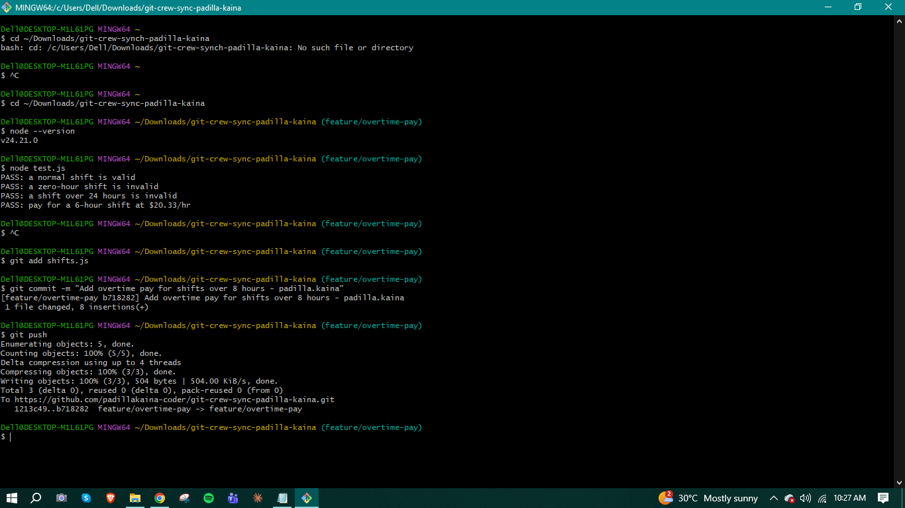
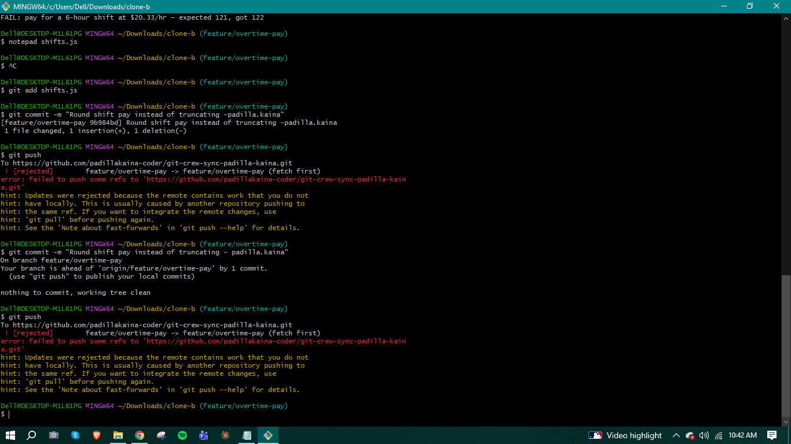
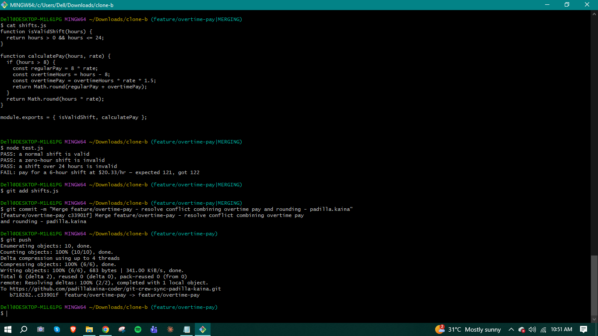
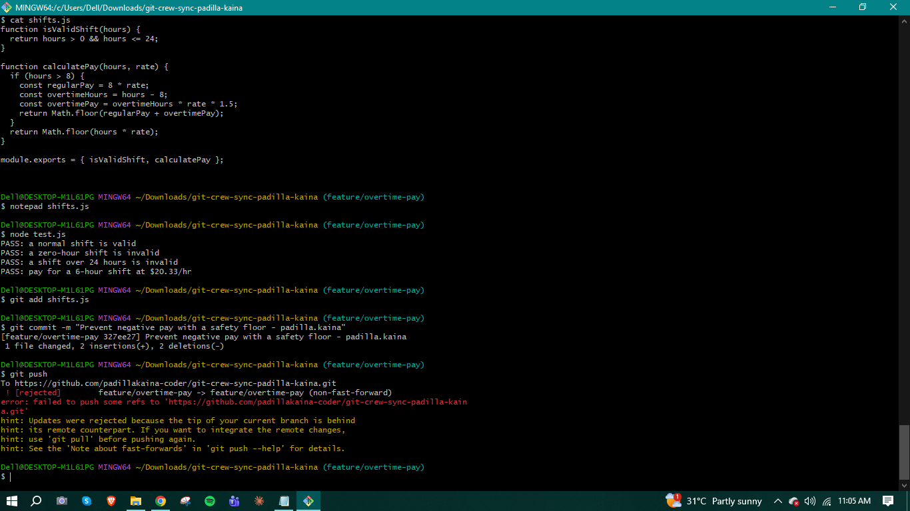
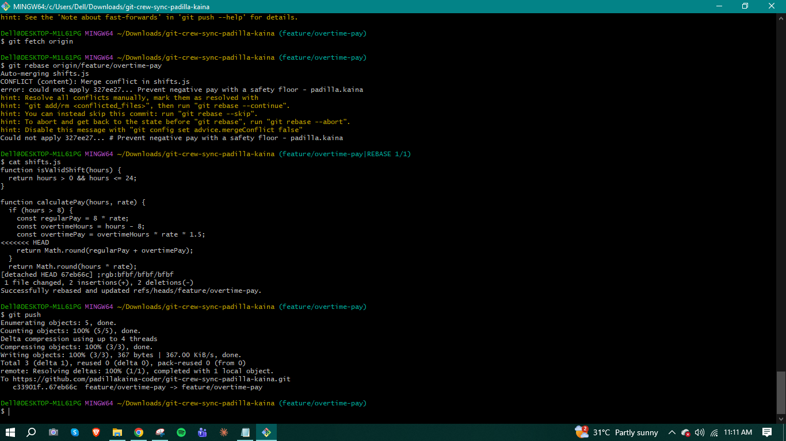
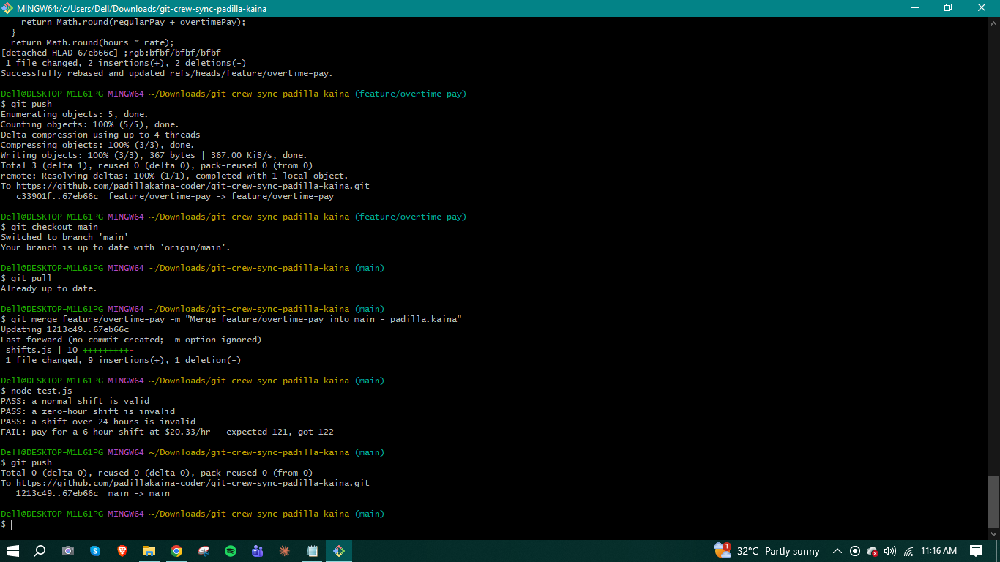
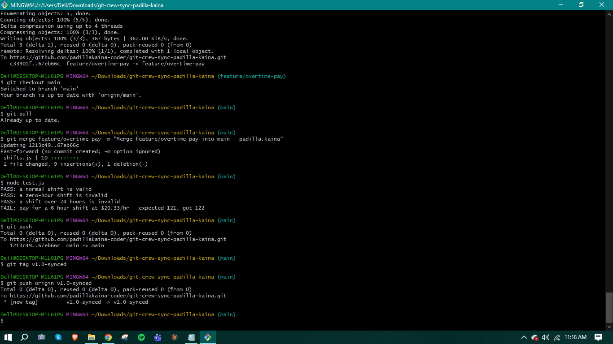
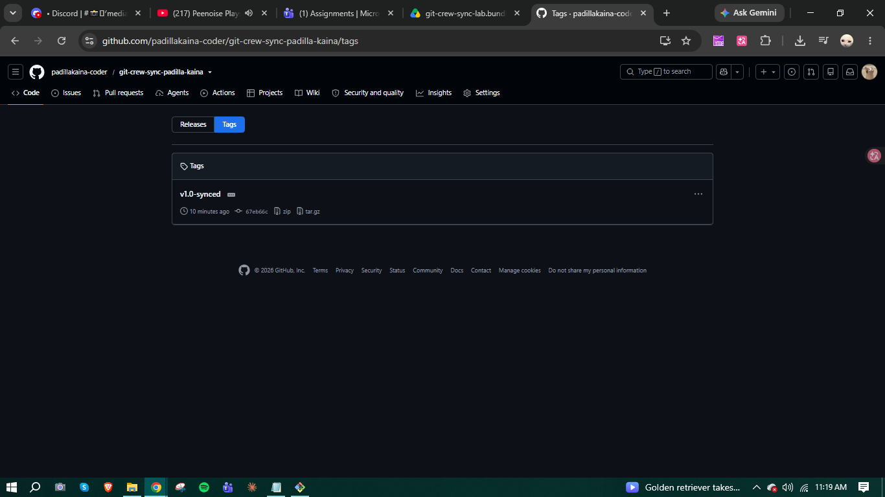

# WORKFLOW.md — Crew Sync: Reconciling Divergent Work on the Shift Scheduler Service

## Task 1 — Push from Clone A
Added overtime pay logic (time-and-a-half for shifts over 8 hours) to `calculatePay` in `shifts.js`, committed, and pushed successfully from Clone A.

## Task 2 — Diverge from Clone B (rejected push)
In Clone B (without fetching Clone A's change), modified the same `calculatePay` function to round shift pay instead of truncating it. Committed and attempted to push — rejected, since the remote had commits Clone B didn't have locally.

## Task 3 — Reconcile with a merge
In Clone B, ran `git fetch` and `git merge origin/feature/overtime-pay`, which produced a real conflict in `calculatePay` (both branches had edited the same return lines). Resolved it by combining both behaviors — overtime pay for shifts over 8 hours, using `Math.round` throughout. Ran tests, committed the merge, and pushed successfully.

## Task 4 — Diverge again, reconcile with a rebase
In Clone A, without fetching first, made another change to `calculatePay` (added a `Math.max(0, ...)` safety floor so pay can never go negative). Committed and pushed — rejected again, since Clone A's local branch was now behind the remote.

Resolved this time with `git fetch` + `git rebase origin/feature/overtime-pay`, which produced a genuine rebase conflict on the same lines. Resolved it by combining all three behaviors — overtime pay, rounding, and the safety floor — into one function. Continued the rebase and pushed successfully, with no force push needed.

## Task 5 — Merge into main
In Clone A, checked out `main`, pulled to make sure it was current, then merged `feature/overtime-pay` into it. Since `main` had no divergent commits, Git performed a fast-forward merge. Pushed `main` to the remote.

## Task 6 — Tag and push
Tagged the final commit on `main` as `v1.0-synced` and pushed the tag to the remote.

---

## Written Answers

**1. What did the rejected push error message tell you, and why did it happen?**

Both rejections showed `! [rejected]` with either `(fetch first)` or `(non-fast-forward)`, along with a hint saying the remote contained work I didn't have locally. This happened because the remote branch had moved ahead of my local branch — someone else (in this case, my other clone acting as a teammate) had already pushed commits that my local branch's history didn't include. Git refuses a push like this by default because accepting it would silently discard those remote commits; it forces you to first incorporate the remote's changes before you're allowed to push your own.

**2. What's the actual difference between how you resolved Task 3 (merge) vs Task 4 (rebase)?**

In Task 3, `git merge` combined the two divergent histories by creating a new merge commit that has two parents — my commit and the remote's commit — preserving the exact order in which each of us actually committed. The conflict was resolved once, inside that merge commit.

In Task 4, `git rebase` instead took my local commit and replayed it on top of the remote's latest commit, rewriting my commit as if I had made it after fetching the remote's changes. This produces a linear history with no merge commit — but it also means my commit's hash changed, since rebase effectively creates a new commit with the same changes but a different parent. The conflict was resolved during that replay step, then I ran `git rebase --continue` rather than a normal `git commit`.

**3. What one habit would have avoided both rejected pushes in this lab?**

Running `git fetch` (or `git pull`) right before every `git push` would have avoided both rejections. In both cases, the push was rejected because my local branch was out of date with the remote — fetching first would have surfaced that immediately, let me merge or rebase in a lower-pressure moment, and avoided the rejected-push error entirely.

**4. Which approach — merge or rebase — would you default to on a shared team branch, and why?**

I'd default to merge on a shared team branch. Merge preserves the true history of who committed what and when, without rewriting commit hashes — which matters on a branch other people are also pulling from, since rebasing commits that others have already fetched can cause confusing duplicate commits or force-push conflicts for teammates. Rebase is better suited to cleaning up my own local/feature branch history before it's shared, but once a branch is shared with a team, rewriting its history gets risky.
